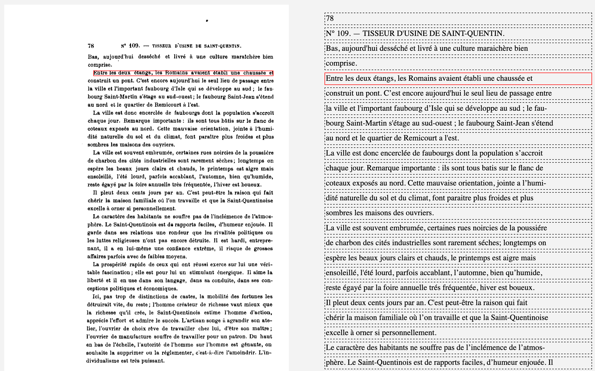

# kraken-ocr-data

:fire: [@jeandamien-genero](https://github.com/jeandamien-genero/) — :fire_engine: special thanks to [@Lucaterre](https://github.com/Lucaterre)

## About

This repository is made to present data used or made up in an ocr attempt using [Kraken ocr system](http://kraken.re/). The initial purpose was to transcript 3 chapters of *Les ouvriers des deux mondes* (Volume 3, book 3) published in 1913. It is a collection of french sociology surveys of the early XXth century usually referred to Le Play's monographs (french *les  monographies de Le Play*).

The original book can be found in the Princeton University Library. It was digitized by Google Books and, thanks to the HathiTrust Digital Library, is accessible at [there](https://babel.hathitrust.org/cgi/pt?id=njp.32101064529215).

The work was conducted by Jean-Damien Généro, engineer at [Centre Maurice Halbwachs](https://www.cmh.ens.fr/) (affiliate to the École normale supérieure and CNRS), for the research program "[TIME US](https://timeus.hypotheses.org/)".

## Content

* `./scripts/` : scripts used in the process (one bash script and three python functions) ;

* `./training_data_sample/`: only one page from the training data (`.jpeg`, `.tiff`), the ground truth (`.txt`) and the segmentation files made up by Kraken out of `output_109a.html` data (`.txt` & `.png`).

* `output_109a.html` : file resulting of the `ketos transcribe` command (segmented images and transcription).

* `terminal_kraken_training.txt` : copy of terminal data during the training.

* `model_best.mlmodel` : best model resulting of Kraken training.

## Data

* 80 pages, 3150 segments and ground truth transcriptions.

* 14 epochs, best model is 98% accuracy report.

## Process

#### Step one : getting images and binarzing them

Images have been downloaded from the HathiTrust Digital Library and binarized using kraken (see [`binarize` function](https://github.com/jeandamien-genero/kraken-ocr-data/blob/a5e109407e1a36686e5384c68ab1a0f19711ad55/scripts/process_scripts.py#L16)).

#### Step two : getting ground truth transcriptions

Ground truth transcriptions are needed to perform training. For this purpose, many tools could have been used. I chose Transkribus to segment and to automatically transcribe 80 images from monographs 109, 109 bis and 110 ; I then corrected this first transcription by hand.

Transkribus allows exports in `ALTO` and `text` ([000_ground_truth.txt](https://github.com/jeandamien-genero/kraken-ocr-data/blob/main/training_data_sample/000_ground_truth.txt)).

#### Step three : segmenting with Kraken and implementing ground truth

In a directory containing all `.tiff`images, I ran the `ketos  transcribe -o output.html *.tiff` command. It initialized an [`output.html`](https://github.com/jeandamien-genero/kraken-ocr-data/blob/main/output_109a.html) file containing segmented images and boxes for transcription of each segment *(see below picture)*. I filled them out with ground truth from Transkribus with the help of a Python `Beautifull Soup` script ([`training_data`](https://github.com/jeandamien-genero/kraken-ocr-data/blob/a5e109407e1a36686e5384c68ab1a0f19711ad55/scripts/process_scripts.py#L45)).

#### Step four : getting training data and perform actual training

I ran the `ketos extract --output output_directory *.html`command, which analyzes the `output.html`file and creates a pair of `.png` and `.txt` files containing image of a segment and its ground truth transcription in a new directory ([`output_directory`](https://github.com/jeandamien-genero/kraken-ocr-data/tree/main/training_data_sample)).

After this, I performed the actual training by running the `ketos train *.png` command in the `output_directory`. Fourteen epochs have been necessary to complete the training. For each epoch, a model was created (`.mlmodel`) ; Kraken only stops when the error rate stops increasing significantly. It then choose the best model, which was epoch 9 (98% accuracy report). You can check out all the process in the [terminal_kraken_training.txt](https://github.com/jeandamien-genero/kraken-ocr-data/blob/main/terminal_kraken_training.txt) file.

*As I didn’t have access to a computer cluster as I was used to at Inria Paris, this step was very tideous and took me up to 3 hours.. Make sure you don't have anything important to do on your computer before running `ketos train` !*

#### Final step : using the best model to perform transcriptions

I am now able to transcribe an image with kraken, by running this command : `kraken -i [img file] [output file] segment ocr -m 
model_best.mlmodel`.

For an unknown reason, [@Lucaterre](https://github.com/Lucaterre) and I could not find the way to transcribe more than one image with a single command : at each time, the output file was rewritten. We solved this problem by writting a bash script which  iterated over every images in a directory [batch_recog_kraken.sh](https://github.com/jeandamien-genero/kraken-ocr-data/blob/main/scripts/batch_recog_kraken.sh).
